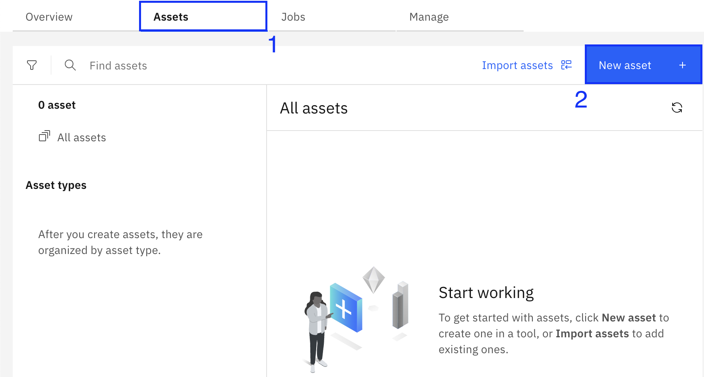
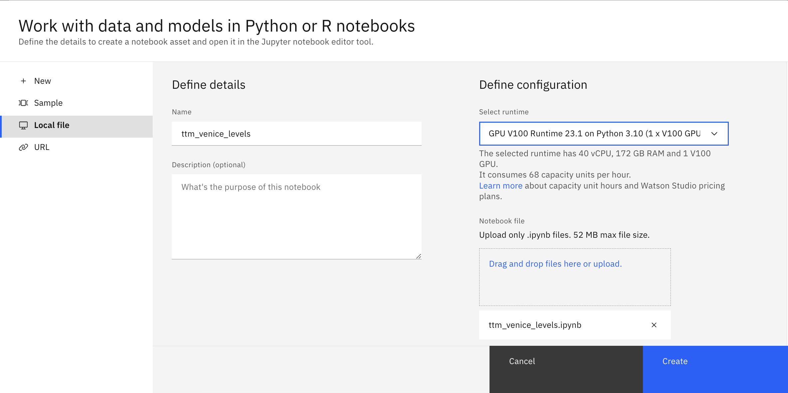
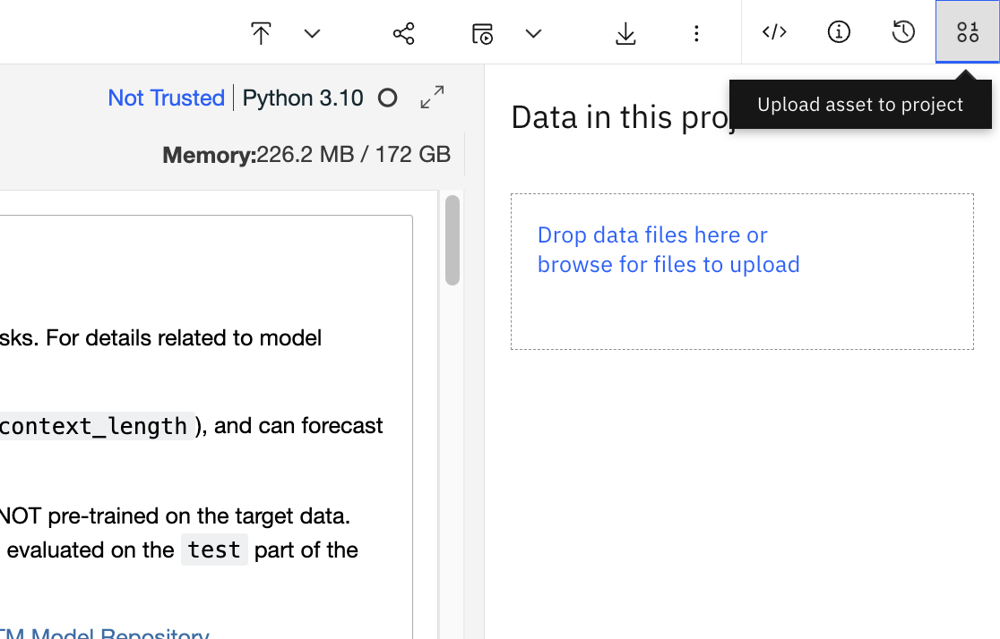
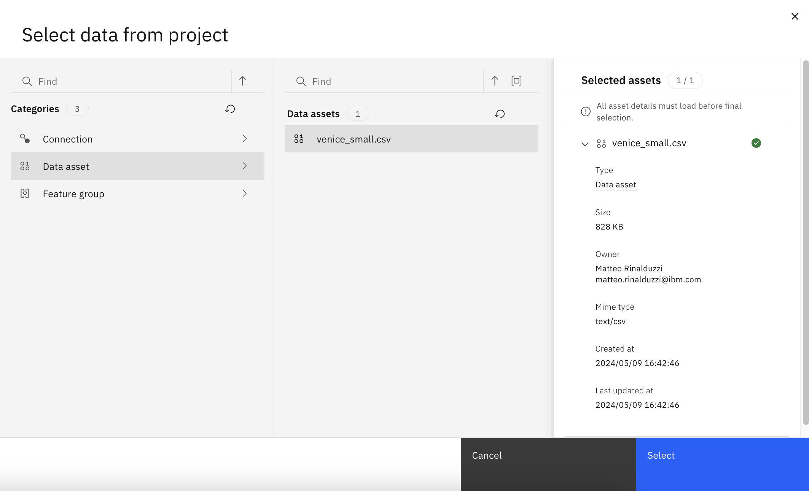
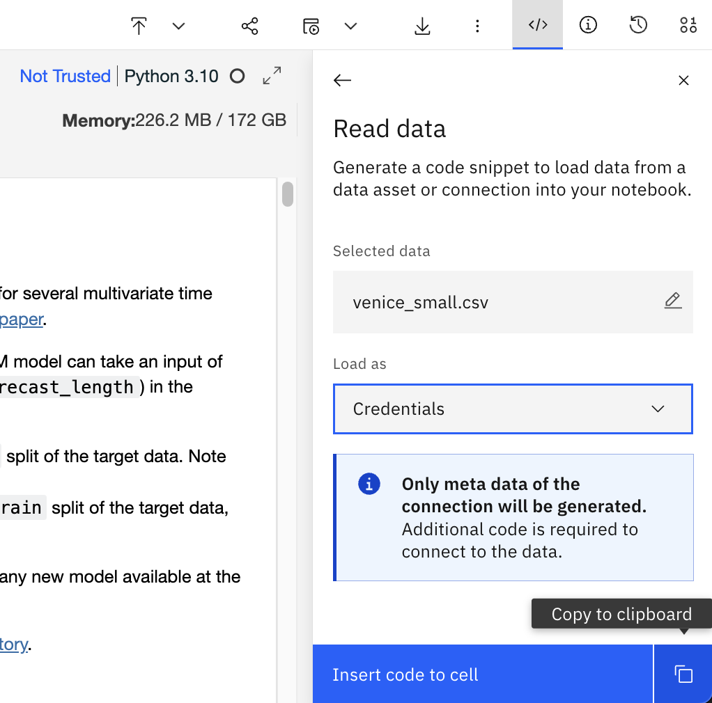
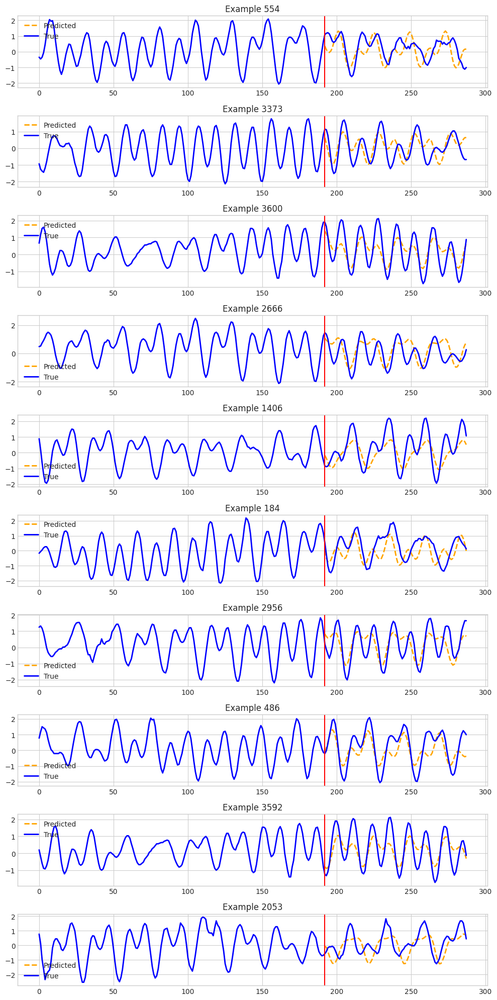
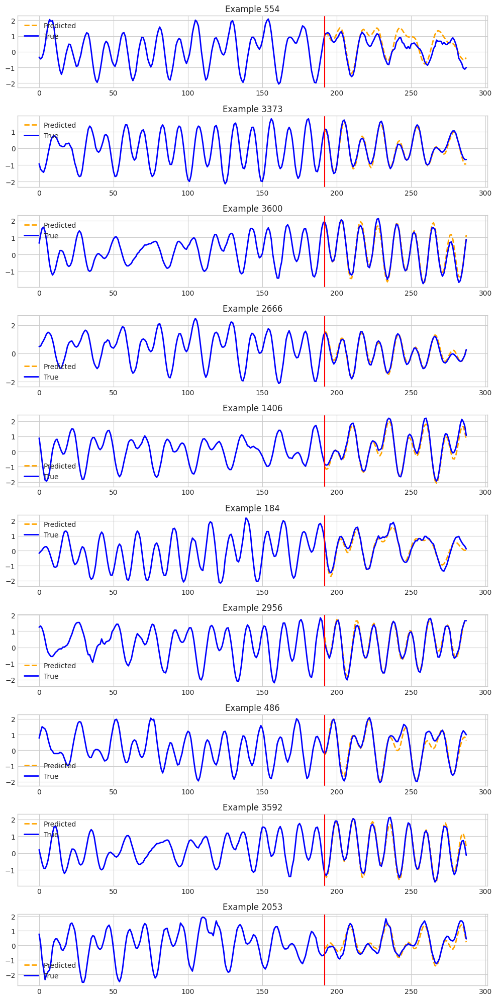

# Predicting Venetian Lagoon Tide Levels with Multivariate Time Series Modeling

*[Paolo Bianchini](https://github.com/paolob67), [David Proietti](https://github.com/proz92), [Matteo Rinalduzzi](https://github.com/matteorinalduzzi)*

## Abstract 
This article explores the application of foundation models for predicting tide levels in the Venice Lagoon.

In particular, we leverage [ibm-granite/granite-timeseries-ttm-r2](https://huggingface.co/ibm-granite/granite-timeseries-ttm-r2) (Tiny Time Mixer or TTM), a foundational model for time series forecasting developed and open-sourced by [IBM Research](https://arxiv.org/pdf/2401.03955.pdf), in order to demonstrate how foundation models could democratize access to time series forecasting technologies, allowing SMEs with limited statistical knowledge to put their domain expertise in action with ease. TTM is part of the wider [IBM Granite](https://huggingface.co/ibm-granite) foundation model family that IBM made available on Hugging Face for the open-source community and that also includes language and code.

Furthermore, we demonstrate how such models can be easily deployed and run on the [IBM watsonx platform](https://www.ibm.com/watsonx) so to streamline the process and unlock additional benefits such as proper AI governance.

The work leverages data retrieved from the official [portal of the City of Venice](https://www.comune.venezia.it/it/content/centro-previsioni-è-segnalazioni-maree) and from [ISPRA Servizio Laguna di Venezia](https://www.venezia.isprambiente.it/rete-meteo-mareografica), two of the major institutional data providers for what concerns sea levels in the Venice Lagoon.

The article is developed as follows: firstly we provide a brief overview of the high tides phenomenon in the Venice Lagoon and the techniques usually leveraged for estimating the sea level; secondly, we describe the process of data acquisition, data cleaning and data preparation performed in order to obtain the input datasets for our models; then we show how to use TTM models for both one-shot inference against the base pre-trained model and few-shot fine-tuning based on a sample of our data; finally, we present the obtained results, discuss the possible implications of the use of foundational models in time series forecasting and address how the current work could be expanded.

The code for implementing this approach is provided in the Jupyter Notebooks in this repository.

Our aim with this article is that this approach offers a promising solution for time series forecasting tasks, particularly when combined with a user-friendly platform like watsonx. Specifically:
1. **Feasibility of data science project:** A data science project leveraging publicly available data and open-source models (TTM by IBM Research) was created to predict tide levels in the Venice Lagoon. 
2. **Effectiveness of watsonX platform:** The IBM watsonx platform provided a convenient environment for running the model tuning and predictions. The platform facilitated easy integration with the GitHub repository and seamless import of necessary artifacts within the machine learning service. 


## Introduction

The Venice Lagoon is a unique ecosystem where the city of Venice itself is built on a network of islands and canals. This beautiful setting comes with a challenge: fluctuating tide levels. Particularly high tides, known as "acqua alta," can flood parts of the city, impacting residents and infrastructure.

Predicting these high tides accurately, but also giving indication on times for high and low tides in the day, is crucial for flood forecasting and water management. By knowing the expected water level, authorities can activate flood barriers, issue warnings, and adjust transportation routes to minimize disruption.

Such study is a two-step process, according to [ISPRA](https://www.venezia.isprambiente.it/modellistica). First, scientists separate out the predictable influence of the moon and sun using established methods. Then, they tackle the more chaotic effect of weather. Here, two approaches come into play. Statistical models analyze past data on tides, weather patterns, and even forecasts to find reliable connections and predict future surges. Deterministic models, on the other hand, use powerful computer simulations to mimic how the ocean responds to wind and pressure, calculating the surge across the entire Mediterranean.  

By combining these methods, scientists can provide accurate short-term forecasts (12-48 hours) and a general idea of the tide's direction over longer periods (3-5 days). 

In this context, we explore the use of a foundational model specifically developed to handle time series data for predicting sea levels in the Venice Lagoon. Such an approach allow us to consider multiple factors that influences tides without directly handling the complex statistical techniques that are usually associated with multivariate forecasting. In doing so, we leverage not only astronomical cycles but also meteorological factors such as:

- Wind speed and direction
- Atmospheric pressure
- Temperature
- Rain

## Time Series: a Powerful Tool for Forecasting

Before diving into our project, it is useful to recall some basics of Time Series Analysis.<br /><br />
Generally speaking, a time series is a collection of data points indexed in chronological order: imagine temperature readings taken every hour, or stock prices recorded daily - these are all examples of time series data. The power of Time Series Analysis lies in its ability to exploit the inherent temporal relationships within the data for forecasting purposes. 

Time Series Analysis can be applied in various forecasting problems:

* **Demand forecasting:** Businesses can predict future sales trends based on historical sales data, seasonality, and marketing campaigns. 
* **Financial forecasting:** Investment firms can analyze past stock market movements to predict future trends and make informed investment decisions.
* **Weather forecasting:** Meteorological agencies use time series models incorporating temperature, pressure, and humidity data to predict future weather patterns.
* **Inventory management:** Retailers can optimize stock levels by forecasting future demand using historical sales data and lead times.

Traditionally, models exploiting moving averages, exponential smoothing and autoregressive techniques have dominated the field of time series analysis but with the advent of big data and advanced computational power, modern machine learning (notably, Deep Learning) techniques have come to the stage and started to gain attention. Without the aim to provide a comprehensive review of all the different statistical models and techniques applied in Time Series Analysis, hereafter we propose a brief summary of the main models usually encountered in this field (for a comprehensive review see R.J. Hyndman and G. Athanasopoulos - "Forecasting: principles and
practice" - Texts: Melbourne, Australia, 2021, [available here](https://otexts.com/fpp3/)):

* **Exponential Smoothing:** a family of models which us a decay factor to give more weight to recent observations and less weight to older observations. This model is particularly used for short-term forecasting (e.g. financial time series, where short-term trends and patterns are of particular interest) 

* **AR (AutoRegressive) Models:** Autoregressive (AR) models uses past values of the time series to predict future values. The basic idea behind AR models is to use past values of our target variable as regressors for computing the next value of the target variable itself. The order of the autoregression (p) determines how many past values are used for the prediction of the next value

* **MA (Moving Average) Models:** Differently from AR models, Moving Average (MA) models use previous error terms to predict future values of the target variable. The order of the moving average (q) determines how many past values of the error terms are used for the forecast.

* **ARMA (Autoregressive Integrated Moving Average):** these models an Autoregressive component (AR) with a Moving Average one (MA). By combining these two techniques, the ARMA model can capture both short-term and long-term dependencies in stationary time series data, making it suitable for various applications such as stock price prediction, demand forecasting, and signal processing. The order of the model, denoted as (p, q), specifies the number of lagged terms used in the autoregressive and moving average components, where p represents the number of autoregressive terms and q represents the number of moving average terms.

* **ARIMA (Autoregressive Integrated Moving Average):** ARIMA models are an extension of ARMA models that includes an additional integration term, which accounts for differencing in the time series data. Differencing is a technique used to make non-stationary time series stationary by removing trends and seasonality. By incorporating differencing into the model, ARIMA can handle more complex patterns and relationships in the data, making it particularly useful for time series data with missing values or outliers. 

* **Deep Learning Architectures for TS Analysis:** Among the many deep learning applications to time series data developed in the last years, Recurrent Neural Networks (RNNs) and Long Short-Term Memory (LSTM) networks emerge as the two main architectures used in this field. These models are particularly suited for capturing complex temporal patterns in data, leading to highly accurate forecasts especially for non-linear data. 

* **Foundation Models for TS Analysis:** Recently, the rise of foundational models in various fields (notably NLP and Computer Vision) have brought interest in developing similar models and approaches in time series analysis (e.g. [The Battle of time-series transforers](https://www.linkedin.com/pulse/ts-foundation-models-battle-time-series-vijay-ekambaram/)). In this context, IBM Research has open-sourced Tiny Time Mixers, a class of models pre-trained on curated and diverse time series data that shows very good benchmark both on zero-shot inference and few-shot fine-tuning of the base model.

When building a time series model, it's crucial to distinguish between two types of data: endogenous and exogenous variables.

* **Endogenous Variables:** These are the core time series data points you aim to predict. In our Venice Lagoon example, the endogenous variable would be the tide levels at a specific location. 
* **Exogenous Variables:** These are external factors that can influence the endogenous series. For instance, when predicting tide levels, exogenous variables might include wind speed, atmospheric pressure, or moon phase. 

Time series models can leverage the relationship between these endogenous and exogenous variables. By incorporating these external factors, models can capture a more comprehensive picture and improve prediction accuracy.

Predicting tide levels in the Venice Lagoon is a prime example perfectly suited for time series analysis, especially when considering exogenous variables. Here's why:

* **Historical Data Availability:** Long-standing records of tide levels exist, providing a rich dataset for training time series models.
* **Cyclical Nature:** Tides exhibit predictable daily and seasonal cycles that time series models can effectively capture.
* **External Influences:** Meteorological factors like wind and atmospheric pressure significantly impact tide levels. Time series models can incorporate these external factors (exogenous variables) for more comprehensive forecasting.

By analyzing historical data on wind patterns, rains' levels, temperature and atmospheric pressure (exogenous variables) as well as on the previous sea levels (endogenous variable), time series models can provide predictions of future lagoon water levels.

## Model Development with TSFM

The [IBM TSFM library](https://github.com/ibm-granite/granite-tsfm/blob/main/README.md) offers an appealing toolkit for building efficient time series forecasting models. We briefly discuss how we leverage TSFM to construct a model for predicting Venetian Lagoon tide levels.

TinyTimeMixers (TTMs) are compact pre-trained models for Multivariate Time-Series Forecasting, open-sourced by IBM Research and available for download from HF or from the TSFM library. TTMs follow a multi-level architecture designed for flexibility and efficiency in various time series forecasting tasks (see Figure 1(a) in the [reference paper](https://arxiv.org/pdf/2401.03955.pdf)) and appears to be well-suited for problems like tide level forecasting where astronomical cycles and past weather patterns influence future water levels. TTM has proved to yeld optimal results with zero-shot evaluation (using only the pretrained model) or with few-shot fine tune and evaluation. 

The idea is to include several relevant factors from the retrieved datasets, beyond tide level data, as input features for the model. These features encompass:

- Wind speed and direction
- Atmospheric pressure
- Air temperature
- Rainfall (if data is available and deemed statistically significant)

By incorporating these exogenous variables, the model can paint a more comprehensive picture of the forces affecting the lagoon's water level and enhance prediction accuracy.

## Data Acquisition and preparation

The data for this project will be primarily sourced from the **Area Maree e Lagune** (Tide and Lagoon Area) of the **Istituto Superiore per la Protezione e la Ricerca Ambientale** (ISPRA) in Italy. ISPRA is a renowned research institute responsible for monitoring and managing water resources in Italy.

Specifically, we will utilize data from ISPRA's **Rete Mareografica Lagunare di Venezia** (Venetian Lagoon Tide Gauge Network, RMLV). This network comprises 29 weather-tide gauge stations strategically located throughout the Venetian Lagoon and along the Upper Adriatic coast. These stations are equipped with advanced electronic equipment adhering to international standards set by organizations like the World Meteorological Organization (WMO) and the Intergovernmental Oceanographic Commission (IOC).

The RMLV provides a wealth of data, including:

* **Sea level measurements:** Continuously recorded sea level data at all 29 stations, providing a detailed picture of water level fluctuations in the lagoon.

* **Meteorological data:** Selected stations measure additional parameters like wind direction and speed, atmospheric pressure, precipitation, air temperature, relative humidity, solar radiation, and wave motion.

* **GPS data:** Three key stations (Punta della Salute, Lido Diga Sud, and Grado) are equipped with co-located tide gauges and GPS receivers. This dual setup enables simultaneous monitoring of both relative sea level changes (tide gauge) and vertical land movement (GPS) at these locations.

ISPRA's central office facilitates real-time data exchange with other meteorological and marine networks operated by ISPRA (nationwide), the Municipality of Venice (CPSM), ARPA Veneto, ARPA Friuli Venezia Giulia, and ARPA Emilia Romagna. This collaboration fosters a comprehensive hydrological monitoring framework for the entire Upper Adriatic region.

The data collected by the RMLV serves various purposes, including:

* **Daily Tide Bulletin:** Generation and dissemination of the daily Tide Bulletin, providing real-time and forecasted tide information for the Venetian Lagoon.

* **Exceptional Tide Forecasting:** Development of forecasts for exceptional tides (acqua alta) events, enabling proactive measures to mitigate their impacts.

* **Data Analysis and Research:** Comprehensive analysis of tide and meteorological data to understand long-term sea level changes, extreme events, and other phenomena relevant to coastal management and the protection of Venice from high tides.

The RMLV's rich and well-maintained dataset, coupled with ISPRA's expertise in water resource management, makes it an ideal source for developing a robust time series model to predict Venetian Lagoon tide levels.

We provide a [Jupyter Notebook](https://github.com/matteorinalduzzi/TTM/blob/main/datasets/venice/create_venice_ds.ipynb) designed to merge weather data from multiple datasets for the city of Venice, covering the years 2020 to 2022. The data includes level, wind speed, wind direction, pressure, temperature, and rain. The notebook leverages preprocessed and quality-controlled data downloaded from ISPRA's RMLV network, eliminating the need for extensive cleaning steps. The data is assumed to be spread across multiple text files, one for each year, and stored in separate directories based on the weather parameter (e.g., level, pressure, rain, etc.). 

The notebook performs the following steps:

1. **Imports and Definitions:**
   - Necessary libraries like pandas are imported.
   - A dictionary, `dataset_info`, is created to specify the directory location and column name for each weather parameter.
   - A helper function, `load_datasets`, is defined to load data from a specific year and directory. It handles potential file exceptions and performs basic cleaning tasks.

2. **Load and Merge Data:**
   - Each weather dataset is loaded using the `load_datasets` function.
   - An empty DataFrame, `df_venice`, is initialized to store the merged data.
   - DataFrames are progressively merged on the 'DATE' column, resulting in a combined DataFrame containing all weather parameters.

3. **Verify and Plot Data:**
   - A function, `missing_zero_values_table`, is used to identify columns with missing or zero values and their respective percentages.
   - Area plots are generated to visualize the variations in each weather parameter over time.

4. **Fill Missing Temperature Data:**
   - A function, `fill_missing_temperature`, is defined to address missing temperature values.
   - It imputes missing values by leveraging the mean temperature for the corresponding date and time based on high-resolution timestamps.

5. **Truncate for Continuous Dates:**
   - Another function, `copy_rows_until_missing_date`, is defined to extract a subset of the data that ensures no missing 'DATE' values exist within a specified time interval (e.g., 5 minutes in this case).

6. **Create Files:**
   - Two CSVs are created:
     - `venice.csv`: Contains the entire merged dataset.
     - `venice_small.csv`: Contains a subset of the data where timestamps are restricted to every hour (i.e., minutes are either 0 or 30). 

Once the dataset is created it is ready to be loaded and used for forecasting with the different Jupiter Notebooks provided in this repository.

## Model inference and few-shots fine-tuning

The various Jupiter Notebooks provide the code blocks needed for loading our dataset and performing inference and a small fine-tuning on the TTM base model.

The notebooks perform the following steps:

1. **Imports and Definitions:**
   - Necessary libraries like torch and tsfm tools are imported.
   - A dictionary, `dataset_info`, is created to specify the directory location and column name for each weather parameter.
   - A helper function, `load_datasets`, is defined to load data from a specific year and directory. It handles potential file exceptions and performs basic cleaning tasks.

2. **Functions' definitions:**
   - A data loader (`get_data`) function is defined for loading, splitting and pre-processing our dataset leveraging tools from the tsfm library.
   - A `zeroshot_eval` function is defined for running the predictions against the TTM base model and plot the output against the test data partition.
   - A `few_shot_finetune_eval` function is defined for fine-tuning the TTM base model using a 5% sample of our training data, inferencing against the tuned model and plot the forecasted data against the test data.

3. **Training and inference:**
   - A simple run of the previously defined functions in order to produce the expect output.

## Execute the notebook

The provided notebooks can be executed locally if you have the appropriate compute resources, or you can leverage a Platform-as-a-Service environment like watsonx.

### How to run the notebook locally

To run the notebooks locally, you can follow these steps:

1. **Clone the Repository**: Use git clone to download the repository to your local machine. For the TTM repository, you would run:
   ```console
   git clone https://github.com/matteorinalduzzi/TTM.git
   cd TTM
   ```
2. **Install Dependencies**: Run the [installation notebook](https://github.com/matteorinalduzzi/TTM/blob/main/install_tsfm.ipynb) in order to be able to experiment with the [tsfm library](https://github.com/ibm-granite/granite-tsfm). This notebook is setting up the environment for working with the tsfm library by cloning the repository, adjusting Python version requirements, and installing the necessary dependencies. 

3. **Run the Notebook Cells**: Execute the notebook and look at the results.

### How to tun the notebook on watsonx.ai platform

Multivariate time-series forecasting often involves complex mathematical computations and large amounts of data processing, especially when using machine learning models. Due to this, executing the Python notebook described in this article locally on a computer can be difficult and may not yield optimal results. In such cases, using cloud-platforms like watsonx may be more suitable alternatives.

#### Provision the environment
In order to quickly access IBM watsonx, you can sign up for a free trial on the IBM Cloud platform: simply visit the [IBM watsonx webpage](https://www.ibm.com/it-it/watsonx), click on the “Try it for free” button, and follow the instruction to complete the registration process.

For IBM Business Partners, watsonx can also be accessed through the IBM Technology Zone platform. For any detail on how to access the IBM Techzone platform and its associated policies, please contact an IBM representative.

#### Setup the environment
After logging into watsonx, you need to first create a new project. A project is a collaborative workspace where you work with data and other assets to accomplish a particular goal. For a quick introduction on how to create a project in watsonx.ai, check out the [product documentation](https://www.ibm.com/docs/en/watsonx/saas?topic=projects-creating-project).

Once the new project is created, you need to associate a Watson Machine Learning instance to the project. Watson Machine Learning is the ML engine provided with watsonx.ai. Note that if you reserved an environment within TechZone, an instance of WML is already provided. If you do not already have a WML instance, you can create a new one on IBM Cloud for free simply searching for Watson Machine Learning in the IBM Cloud Catalog and selecting a “lite” tier.

In order to associate your WML instance, select the **Manage** tab of the project, click on **Services & integrations**, then on **Associate service** and finally choose the appropriate WML service instance.


#### GitHub Integration with watsonx (only if you have administrator permissions on the GitHub project)
[Here]() you can find the procedure to link a watsonx project to a GitHub repository in order to back up notebooks for source code management. You can skip to the next step if your goal is to run this notebook or any other notebook that does not make part of a github repository that is yours.

#### Import the notebook
Open the watsonx project created previously, select the Assets tab and then click the New asset button: a new pop-up window will appear, presenting the various assets available for preparing data, work with foundational or traditional AI models and automate ML pipelines.


Select 'Work with data and models in Python or R notebooks', then on the left panel open 'Local file' tab and upload manually the notebook or click on 'URL' tab and point to the [notebook](https://github.com/matteorinalduzzi/TTM/blob/main/ttm_venice_levels_watsonx.ipynb) in the GitHub repository. For both the cases it is important to select a runtime with at least one GPU if you want to make the notebook run in seconds instead of tens of minutes. Click on Create.



#### Import the dataset to use in the notebook  
This step describes the procedure to upload and use the dataset of this project within the IBM Cloud Object Storage instance that is associated with the workspace.

Click on the button in the top right corner and then upload the dataset 'venice small.csv' that can be found [here](https://github.com/matteorinalduzzi/TTM/blob/main/datasets/venice/venice_small.csv).


Click on the 'Code Snippets' and select 'Read data' to open the list of the assets available in the project.


Find the dataset file and select it.


The last step is the creation of the credentials to access the dataset stored in the Cloud Object Storage. Select 'Load as Credentials' and then copy the output to the clipboard. Copy the credentials within the appropriate section of the notebook.


Credentials have a format like that:
```
credentials = {
    'IBM_API_KEY_ID': '*******************************',
    'IAM_SERVICE_ID': '*******************************',
    'ENDPOINT': '*******************************',
    'IBM_AUTH_ENDPOINT': '*******************************',
    'BUCKET': '*******************************',
    'FILE': '*******************************'
}
```

#### Run the notebook
Execute the notebook by clicking on the Play button or by executing the code cell by cell.


## Model Evaluation and Results

While this article explores the application of TSFM for Venetian tide level prediction, it's important to acknowledge that we are not aiming to redefine established tide prediction models or propose ourselves as domain experts in Venetian tides or in time series modeling. Our focus lies on demonstrating a real-world use case for TSFM and the TTM model by leveraging the watsonx.ai platform. 

That being said, we can still evaluate the model's performance to assess its qualitative effectiveness in predicting tide levels by looking at the *Predicted* towards *True* plots created by the notebook. More in-depth discussions on the validity of the results and the application of the time series model should probably be carried with better subject expertise.

The following pictures show the result of the evaluation using zero shot approach (first image) and few shot fine-tuning approach (second image). The solid blue line represents the true values of tide levels over time while the dashed orange line represents the predicted values from the algorithms.

|  | 
|:--:| 
| *Zero shot* |

|  | 
|:--:| 
| *Few shot* |

From a qualitative point of view it can be appreciated that the few shot fine-tuning evaluation brings to better results than the zero shot evaluation.

We acknowledge that further refinement might be necessary. This includes exploring additional factors that could influence tide levels and potentially investigating more advanced TSFM architectures for enhanced accuracy. We are open to suggestions from domain experts in tide prediction and water management in Venice. We're sharing the code (via Jupyter Notebook) hoping this could help foster transparency and encourage collaboration for future improvements.

## Discussion and Future Work

This work demonstrates the potential of TSFM models for predicting Venetian Lagoon tide levels. However, several avenues exist for further exploration and refinement.

One key area for improvement lies in expanding the range of factors influencing the phenomenon of interest. By incorporating additional factors that may influence water levels, such as astronomical phenomena (e.g., lunar phases) or even seismic activity, we can potentially enhance the model's accuracy.  A crucial step would be to analyze the impact of each variable on the forecast and compare these findings with existing knowledge of the lagoon's physics. This would allow us to prioritize the most influential variables and tailor the model accordingly.

Furthermore, a comprehensive evaluation comparing TSFM against other time series forecasting models (e.g., ARIMA, LSTMs) is necessary. This evaluation should consider not only accuracy scores but also computational power requirements. Identifying the optimal model in terms of accuracy and efficiency is crucial for real-world deployments.

To achieve a more in-depth evaluation of the TSFM model itself, leveraging domain expertise on Venetian tide level phenomena would be beneficial.  A thorough understanding of the cyclical and episodic events that influence the lagoon's water levels would enable the creation of relevant use cases to benchmark the model's performance against the actual tide prediction models currently in place. This would provide valuable insights into the strengths and weaknesses of the TSFM approach in this specific context.

Finally, exploring advanced tuning strategies targeted at high-tide forecasting would be an exciting avenue for future work. By focusing on this specific use case, we can potentially refine the TSFM model to deliver optimal results for accurately predicting these critical events. This could involve experimenting with hyperparameter optimization techniques or incorporating domain knowledge into the tuning process.

In conclusion, this work establishes a foundation for utilizing TSFM models in Venetian Lagoon tide level prediction. By expanding the variable set, conducting comparative evaluations, and implementing targeted tuning strategies, we can further enhance the model's accuracy and effectiveness in this crucial application. 

## Conclusion

This article explored the application of Tiny Timeseries Mixers (TTM), a foundation model by IBM Research, for predicting tide levels in the Venice Lagoon. The project successfully demonstrated the feasibility of leveraging open-source models and publicly available data for time series forecasting tasks. Furthermore, the article showcased the IBM WatsonX platform's capabilities for streamlining model development and deployment.

The findings highlight the effectiveness of the TSFM-based model in predicting tide levels. This approach offers a promising solution, particularly when combined with a user-friendly platform like WatsonX. However, the importance of continuous improvement cannot be overstated.  

Future work should focus on expanding the model's capabilities through a more comprehensive understanding of the Venice Lagoon's physics.  Incorporating additional relevant variables and analyzing their impact can lead to enhanced accuracy.  Additionally, a comparative evaluation against other time series forecasting models is essential to determine the optimal solution in terms of accuracy and computational efficiency. 

Ultimately, the goal is to refine the TSFM model for the specific use case of high-tide forecasting. By leveraging domain expertise and exploring advanced tuning strategies, we can strive to achieve optimal results for this critically important application.  Accurate tide predictions are paramount for flood mitigation strategies and ensuring the safety of Venice and its inhabitants. This work paves the way for further advancements in time series forecasting models, fostering a future where real-time data analysis empowers informed decision-making.

## Appendix

* Code and Dataset Repository: https://github.com/matteorinalduzzi/TTM
* Granite Time Series Models Collection on HF: https://huggingface.co/collections/ibm-granite/granite-time-series-models-663a90c6a2da73482bce3dc6
